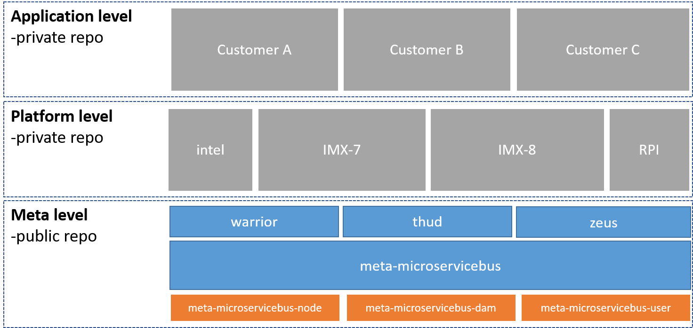
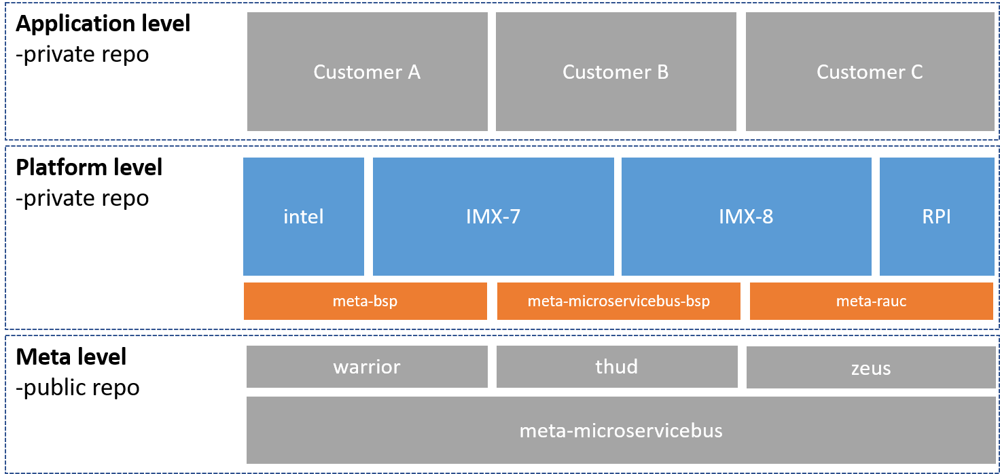
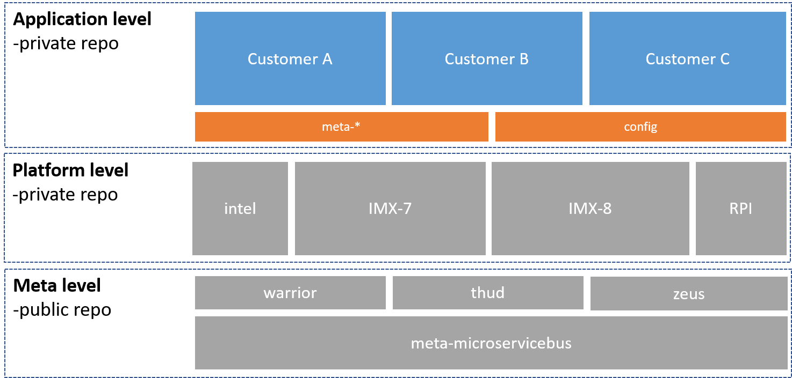

# ---- Under development ----

# meta-microservicebus

**meta-microservicebus** is part of a three level architecture which combined deliver end-customer solution for Yocto based firmware images.

## Meta level
The *Meta level* is made up of core recipes for the microservicebus-node agent to work. These recipes are:
### meta-microservicebus-node
IoT Device Management for: Microsoft Azure, Amazon AWS and IBM Watson. microServiceBus-node is the node.js based device agent used together with microServiceBus.com
### meta-microservicebus-dam
microServiceBus Device Access Management is responsible for managing remote users and access to devices
### meta-microservicebus-user
Recipe handling service users and privilages

## Platform level
The *Platform* level is targeting a specific harware and would always contain the following recipes:
### meta-XXX-bsp
Harware specific base recipe
### meta-microservicebus-XXX
Harware specific customizations for meta-microservicebus
### meta-nodejs
Node.js recipe
### meta-rauc
RAUC is a lightweight update client that runs on your Embedded Linux device and reliably controls the procedure of updating your device with a new firmware revision. RAUC is also the tool on your host system that lets you create, inspect and modify update artifacts for your device.

## Application level
Application level represents the final build configuration specifically targeting customer requirements. *Application level* recipes references a meta-microservice branch and Platform level.

*Application* level recipes always contains the configuration, but may also contain other required recipes such as docker-ce, Azure IoT Edge or GPIO

